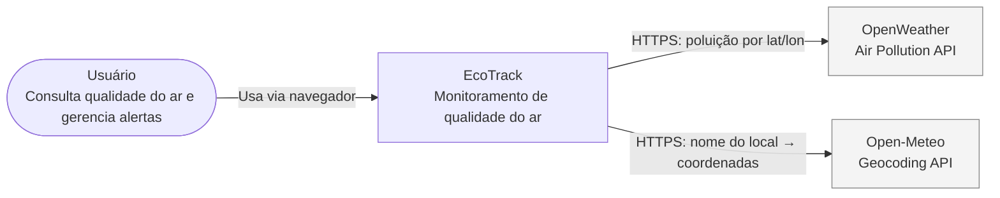
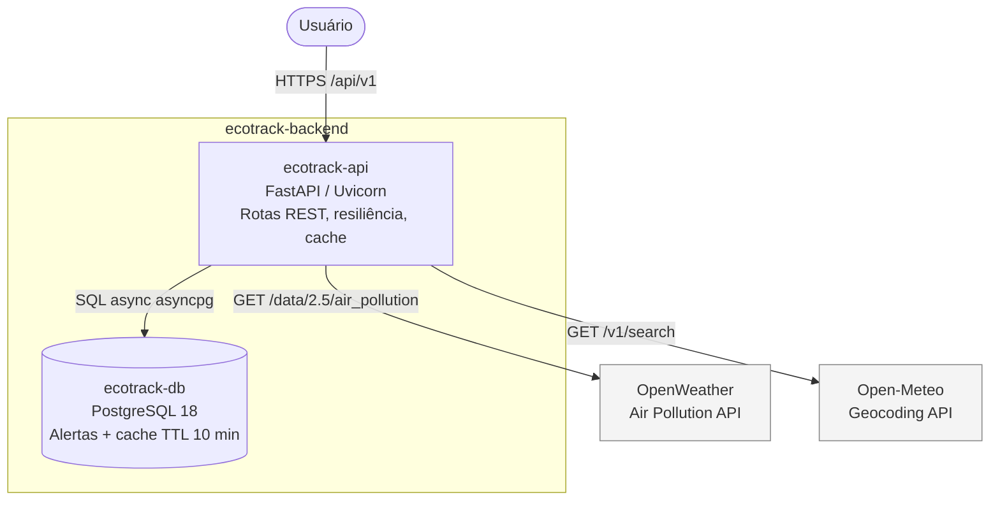

# EcoTrack Backend

API principal do **EcoTrack** — plataforma de monitoramento de qualidade do ar (PM2.5, PM10, CO, NO₂, O₃). Expõe CRUD de alertas georreferenciados, geocodificação por nome via [Open-Meteo Geocoding API](https://open-meteo.com/en/docs/geocoding-api) e consulta assíncrona de poluição via [OpenWeather Air Pollution API](https://openweathermap.org/api/air-pollution), com cache PostgreSQL, Circuit Breaker, throttling e logs estruturados em JSON.

> **Segurança:** a chave `OPENWEATHER_API_KEY` existe **somente** no backend (`.env`, fora do git). O frontend nunca recebe nem envia a chave.

## Stack

| Camada          | Tecnologia                               |
| --------------- | ---------------------------------------- |
| Runtime         | Python 3.12, FastAPI 0.115+, Uvicorn     |
| Banco           | PostgreSQL 18, SQLAlchemy async, Alembic |
| HTTP externo    | HTTPX (timeout 3 s, retries, pybreaker)  |
| Observabilidade | structlog (JSON), correlation ID         |
| Qualidade       | Ruff, Pytest + httpx ASGITransport       |

## Arquitetura (C4)

### Diagrama de contexto (C4 — nível 1)



### Diagrama de containers (C4 — nível 2, backend)



## Rotas da API

| Método   | Rota                            | Descrição                                        |
| -------- | ------------------------------- | ------------------------------------------------ |
| `GET`    | `/api/v1/alerts`                | Lista alertas (paginação, filtro `criticality`)  |
| `POST`   | `/api/v1/alerts`                | Cria alerta                                      |
| `PUT`    | `/api/v1/alerts/{id}`           | Atualiza alerta (parcial)                        |
| `DELETE` | `/api/v1/alerts/{id}`           | Remove alerta                                    |
| `GET`    | `/api/v1/air-quality?lat=&lon=` | Qualidade do ar (cache → OpenWeather → fallback) |
| `GET`    | `/api/v1/geocode?q=&limit=`     | Geocodificação por nome (Open-Meteo, sem chave)  |

Documentação interativa: http://localhost:8000/docs

## API externa — OpenWeather

| Item               | Detalhe                                                                                                                 |
| ------------------ | ----------------------------------------------------------------------------------------------------------------------- |
| **Cadastro**       | https://openweathermap.org/api — criar conta gratuita                                                                   |
| **Rota utilizada** | `GET https://api.openweathermap.org/data/2.5/air_pollution?lat={lat}&lon={lon}&appid={key}`                             |
| **Free tier**      | 60 requisições/minuto (RPM) — o backend aplica throttling (`THROTTLE_RPM`, default 60) na rota `/air-quality`           |
| **Licença / uso**  | Chave de uso **não comercial** no plano gratuito; consulte os [termos da OpenWeather](https://openweathermap.org/terms) |
| **Integração**     | Proxy reverso no backend — o cliente **não** é redirecionado à OpenWeather                                              |

## API externa — Open-Meteo Geocoding

| Item               | Detalhe                                                                                                      |
| ------------------ | ------------------------------------------------------------------------------------------------------------ |
| **Cadastro**       | Não necessário — API pública, sem chave                                                                      |
| **Rota utilizada** | `GET https://geocoding-api.open-meteo.com/v1/search?name={q}&count={limit}`                                  |
| **Licença / uso**  | [CC BY 4.0](https://creativecommons.org/licenses/by/4.0/) — uso **não comercial** conforme termos do serviço |
| **Integração**     | Proxy reverso no backend; fora da janela `THROTTLE_RPM` da OpenWeather                                       |

## Variáveis de ambiente

Copie o exemplo e ajuste os valores:

```bash
cp .env.example .env
```

| Variável              | Obrigatória         | Descrição                                                  |
| --------------------- | ------------------- | ---------------------------------------------------------- |
| `DATABASE_URL`        | Sim                 | URL async (`postgresql+asyncpg://...`)                     |
| `OPENWEATHER_API_KEY` | Para `/air-quality` | Chave da OpenWeather (somente no servidor)                 |
| `CORS_ORIGINS`        | Não                 | Origens permitidas, separadas por vírgula                  |
| `THROTTLE_RPM`        | Não                 | Limite de req/min na rota de qualidade do ar, por processo (default: 60). Com vários workers a cota não é global. |

No Docker Compose, `DATABASE_URL` e `CORS_ORIGINS` já vêm definidos para a rede interna.

## Execução com Docker (recomendado)

Requisito: Docker Engine ou Docker Desktop com integração WSL2.

```bash
cp .env.example .env
# Edite .env e defina OPENWEATHER_API_KEY

docker compose up --build
```

- API: http://localhost:8000/docs
- PostgreSQL: `localhost:5432` (user/senha/db: `ecotrack`)

O container `ecotrack-api` executa `alembic upgrade head` automaticamente na subida.

### Comandos úteis (Makefile)

```bash
make up          # build + sobe em background
make down        # para containers
make logs        # logs da API
make lint        # ruff check
make test        # pytest (requer Postgres acessível)
make db-migrate  # alembic upgrade head manual
make shell       # shell no container da API
make db-shell    # psql no PostgreSQL
```

## Desenvolvimento local (Python 3.12)

Para iterar sem rebuild de imagem:

```bash
chmod +x scripts/setup-local-python.sh
./scripts/setup-local-python.sh
source .venv/bin/activate
pip install -e ".[dev]"

docker compose up -d ecotrack-db   # só o banco
alembic upgrade head
uvicorn app.main:app --reload
```

## CI/CD

O workflow [`.github/workflows/ci-cd.yml`](.github/workflows/ci-cd.yml) executa em cada push/PR para `main`:

1. **Ruff** — lint em `app/`
2. **Pytest** — testes de integração com serviço PostgreSQL 18
3. **Docker build** — valida que a imagem compila
4. **Push GHCR** — publica em `ghcr.io/<owner>/<repo>` apenas em push para `main`

## Estrutura do projeto

```
app/
  main.py                 # FastAPI, CORS, exception handlers
  core/                   # config, database, logging, security
  models/alert.py         # Alert, ReadingCache + repositório
  schemas/                # Pydantic (alert, air_quality, geocode)
  routers/                # alert_router, air_quality_router, geocode_router
  services/               # alert_service, openweather_service, geocode_service
  tests/                  # conftest, test_alerts, test_air_quality, test_geocode
alembic/                  # migrações PostgreSQL
```
